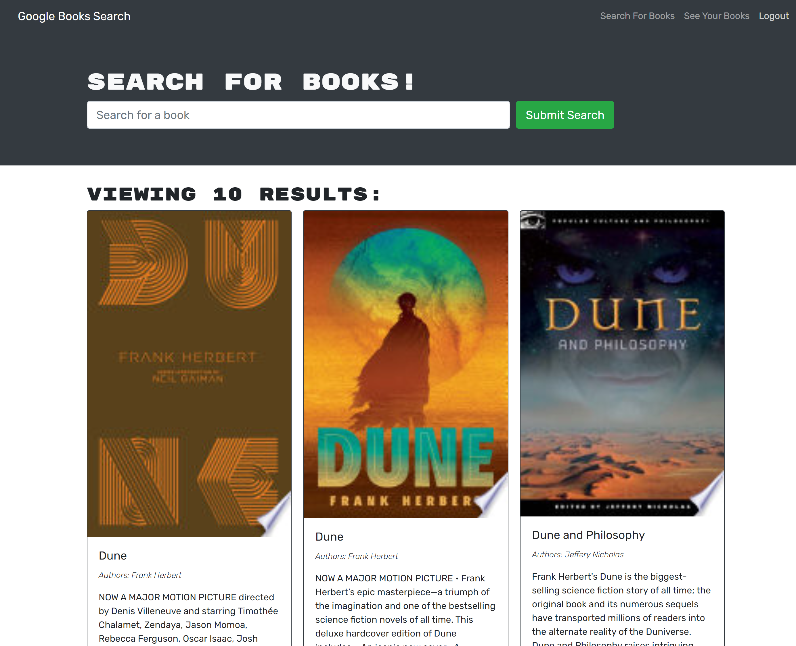

# book-search-engine

The contents of this repository are the code for a Google Books Search tool. Users can search for books and then save those books. Saved books can be viewed on a separate page and removed from the saved list.

The original version of this app used a RESTful API. This version uses a graphQL API.

Deployed app URL - https://stormy-hamlet-88436.herokuapp.com/

Repository URL - https://github.com/alextheordinary/book-search-engine 

